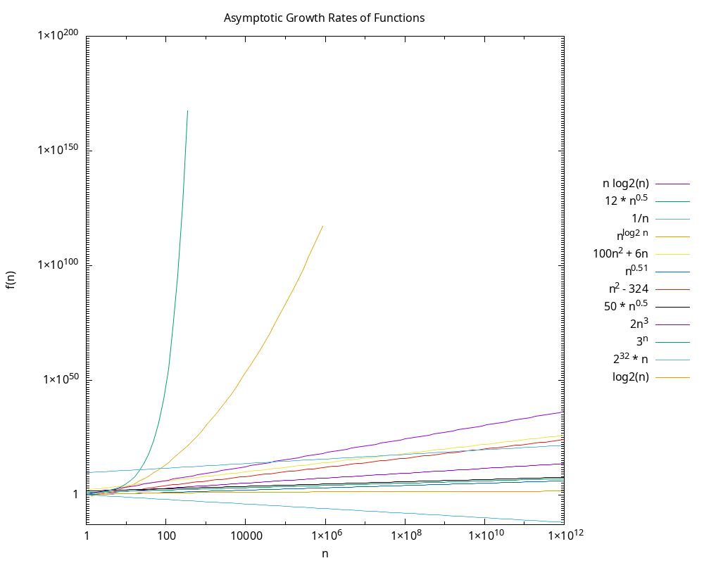

## How the Code Works

The C program is built to compare the Big-O asymptotic growth rates of a bunch of different mathematical functions and then plot them out. It basically handles this in two main steps:  

1. **Ranking the Functions:** First, the code uses a custom FunctionClass struct to break down each math function into its core pieces—like its exponential base, polynomial power (n), and constant multipliers. It loads up an array with 12 different functions and runs them through C's built-in qsort command. The custom sorting rule strictly ranks them from slowest to fastest growing by looking at their most dominant traits first (for example, exponentials will always beat polynomials, which beat logs). 
    
2. **Drawing the Chart:** Once everything is perfectly sorted, the C code opens a pipe directly to Gnuplot using popen("gnuplot", "w"). It feeds Gnuplot all the necessary configuration settings and plot instructions to automatically generate the "growth_rates.png" image file.  

## Why the Graph Looks the Way It Does

To actually make the graph readable and mathematically accurate, a few specific settings had to be tweaked in Gnuplot:

* **Using a Log Scale:** Both the x and y-axes use a logarithmic scale (set logscale xy). This is absolutely necessary to balance out the wild extremes of these functions. Without a log scale, there's no way you could fit a function that shrinks down to almost zero (like 1/n dropping to 10^-13) on the same standard chart as a function that explodes upwards (like 3^n hitting 10^200).  
   
* **A Massive X-Axis:** The x-axis goes incredibly wide, stretching all the way from 1 to a trillion (set xrange [1:1e12]). We needed these super high x-values to overcome some massive constant multipliers. For example, the function 2^32 * n has a giant starting constant of over 4.2 billion. If we kept the x-axis too small, this basic linear function would falsely look like it was dominating higher-order polynomial functions like n^2. Pushing the graph out to 10^12 gives those higher-order functions enough runway to finally overtake the ones with huge starting constants, showing us their true long-term behavior.  
   
* **Capping the Growth:** Finally, to keep the program from completely crashing due to math overflow errors, the fastest-growing functions were given hard cutoff limits. For instance, the plot instructions tell Gnuplot to stop drawing 3^n once x hits 415, and n^(log2 n) stops when x hits 1,000,000. 

## Observations
1. Terminal Output: 
Sorted Order of FunctionsWhen the C program executes qsort, it prints the functions in strict order of increasing asymptotic dominance:  PlaintextFunctions strictly ordered by increasing asymptotic growth rate:

```text
 1. 1 / n               
 2. log2(n)             
 3. 12 * sqrt(n)        
 4. 50 * n^0.5          
 5. n^0.51              
 6. n * log2(n)         
 7. 2^32 * n            
 8. n^2 - 324           
 9. 100n^2 + 6n         
10. 2n^3                
11. n^(log2 n)          
12. 3^n
```

2. Plot Visualization:
Below is the generated Gnuplot output (growth_rates.png) illustrating the relative growth rates across the logarithmic scale:


