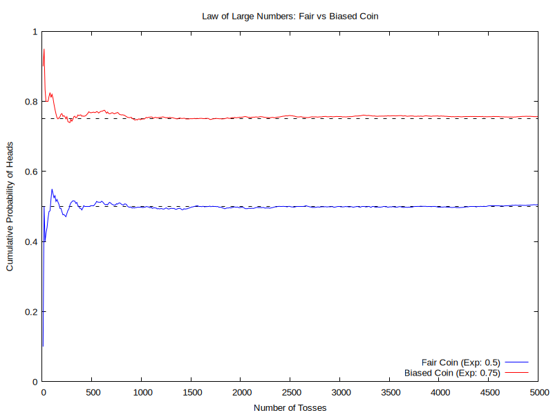

## Understanding the Law of Large Numbers: A Coin Toss Simulation

The Law of Large Numbers is a fundamental theorem in probability theory that describes the result of performing the same experiment a large number of times. According to this law, the experimental probability will converge to the expected theoretical probability as the number of trials increases.

## The Simulation Context

To demonstrate this, we modeled a simulation involving 5000 independent coin tosses for two different types of coins:
1. **A Fair Coin**: The theoretical (expected) probability of landing on Heads is 0.50 (50%).
2. **A Biased Coin**: The theoretical probability of landing on Heads is artificially weighted to be 0.75 (75%).

The C program tracks the cumulative probability at each step of the simulation.

## Observations 

If we examine the visualization provided in the file "coin_simulation.png", we will notice the pattern that perfectly illustrates the theorem.

* **Initial Variance:** In the early stages of the experiment (roughly between 0 and 500 tosses), the cumulative probability lines experience sharp spikes and deep valleys. We can see that initially the probability was fluctuating significantly because the sample size is small—meaning every single toss has a heavy mathematical impact on the running average.
* **Long-Term Convergence:** Notice how the probability later fixed as we grew the number of cases. As the number of tosses steadily climbs toward 5000, the blue line (fair coin) tightly hugs the expected 0.5 mark, while the red line (biased coin) seamlessly stabilizes at the 0.75 mark. 

## Conclusion

This visual representation shows exactly why large sample sizes are required for reliable statistical data. While a small number of trials leaves room for high variance and unpredictable fluctuations, increasing the number of cases smooths out the anomalies, converging the outcome onto the true theoretical probability.