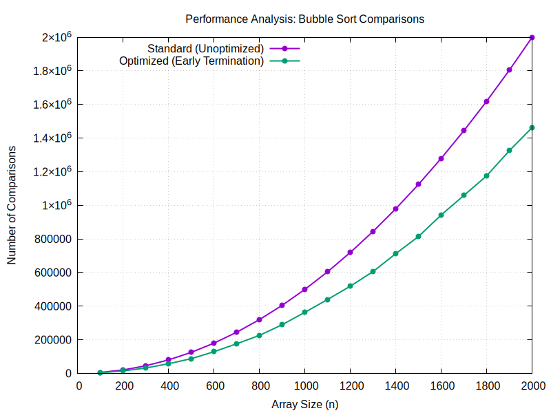

## Bubble Sort Performance Analysis: Standard vs. Optimized

This document outlines the implementation and performance comparison between standard and optimized Bubble Sort algorithms, specifically analyzing the number of comparisons made as the array size increases.

## Implementations
We have implemented two variants of the Bubble Sort algorithm in C:

1. **Standard Bubble Sort (Unoptimized)**: 
   This implementation always completes the `(n-1)` passes, regardless of whether the array is already sorted during the process. It compares adjacent elements and swaps them if they are in the wrong order.

2. **Optimized Bubble Sort (Early Termination)**: 
   This variant introduces a `swapped` boolean flag. During each pass, if no elements are swapped, it means the array is already sorted. The algorithm then terminates early, avoiding unnecessary subsequent passes.

3. **Data Generation & Benchmarking Framework**:
   An automated benchmarking loop tests array sizes from 100 to 2000, averaging results over multiple trials to calculate the total number of comparisons.

4. **Automated Graph Generation via Gnuplot**:
   The C program directly pipes the resulting simulation data into `gnuplot` to dynamically generate a line graph visualization comparing the two algorithms.

## Testing Methodology & Data Structure
To effectively compare the performance of these two implementations, we carefully designed the input datasets. 

### Array Composition
For our trials, we constructed a specialized array where:
* The **first half** of the array consists of completely randomized numbers.
* The **second half** consists of strictly increasing, already sorted numbers.

### Why not use a completely random array?
For a completely random array, the efficiency difference between the standard and optimized bubble sort would be negligible. The chance of $k$ number of elements at the end of the array being completely sorted naturally is almost $0$ for large array sizes. Therefore, the optimized sort would almost never terminate early on purely random large arrays. By explicitly designing the array so that the first half is completely random and the second half has sorted numbers, we create a scenario that allows us to actually compare the difference in efficiencies and showcase the advantage of the early termination optimization.

## Results

The visualization of the simulation clearly displays the divergence in the number of comparisons. The optimized bubble sort effectively avoids redundant comparisons in the sorted upper half of the array.

