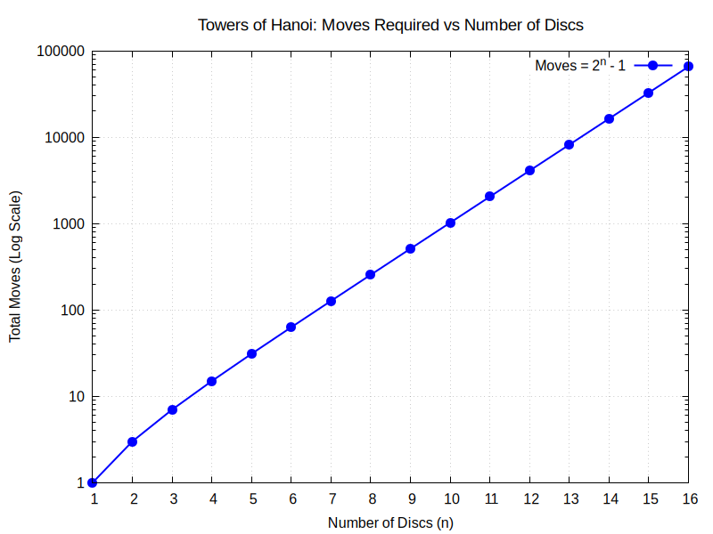

## Tower of Hanoi: Implementation and Complexity Analysis

This document outlines the implementation details of the provided C program, which calculates the minimum number of moves required to solve the Tower of Hanoi puzzle and visualizes the growth rate using Gnuplot.

### Mathematical Complexity
The Tower of Hanoi problem is a classic example of exponential time complexity. To move `n` discs from the source peg to the destination peg, it takes exactly **2^n - 1** steps. 

### Implementation Details
The C program implements several distinct components to achieve the calculation and visualization:

*   **Recursive Algorithm:** The `towerOfHanoi` function is implemented recursively. It simulates the moving of discs and uses a pointer to a `long long` integer (`moves`) to keep an accurate count of the total steps taken.
*   **Gnuplot Integration (IPC):** The program uses `popen("gnuplot -persistent", "w")` to open a pipe directly to Gnuplot. This allows the C code to send plotting commands and data dynamically without needing intermediate text or data files.
*   **Logarithmic Scale:** The graph's Y-axis is configured to use a logarithmic scale (`set logscale y 10`). This is crucial because it accommodates the extremely large values at high `n` (due to the exponential 2^n - 1 growth) while keeping the graph visually clean and rendering the exponential curve as a straight line on the log scale.
*   **Plot Customization:** The code customizes the Gnuplot output thoroughly:
    *   Sets the output terminal to a PNG file (`toh_moves.png`) using the `pngcairo` terminal with specific dimensions (800x600) and fonts.
    *   Adds descriptive titles and axis labels.
    *   Enables a background grid for better readability.
    *   Sets the X-axis range explicitly from 1 to 16 with step increments of 1.
    *   Styles the plot line with points (`linespoints`, blue color, specific line width, and point size).
*   **Dynamic Data Streaming:** A loop computes the moves for `n = 1` up to `n = 16`. Inside the loop, the program evaluates the recursion tree for `n` discs and prints the resulting coordinates (`n` and `moves`) directly into the Gnuplot pipe using `fprintf`.

## Generated Plot
The output of the program produces the following graph, illustrating the exponential growth on a logarithmic scale:

