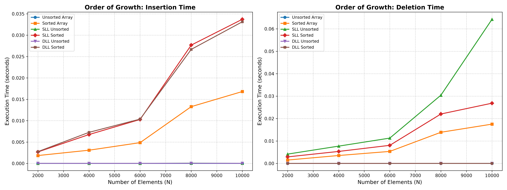
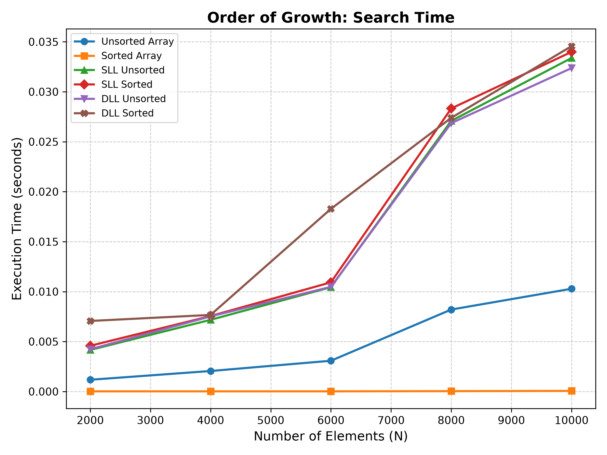
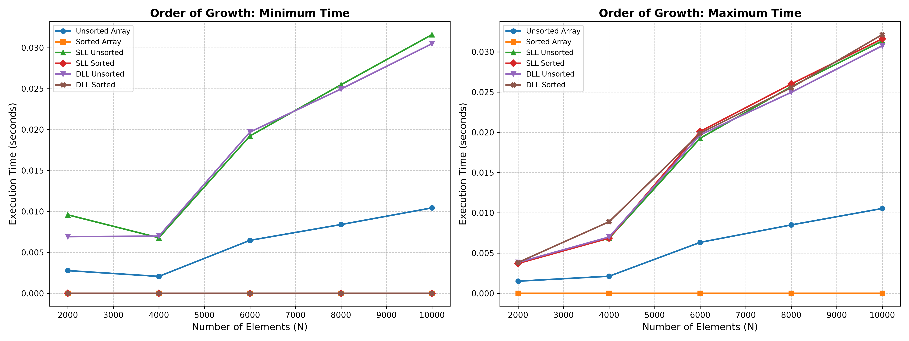
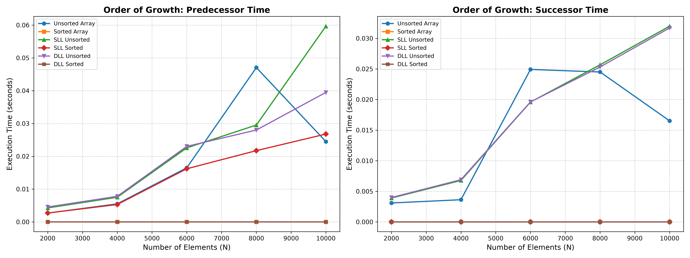

## Dictionary Operations

## How the Code Works
1. **Data Generation (C Code):** The C program (`q1.c`) implements six fundamental data structures: Unsorted Array (UA), Sorted Array (SA), Singly Linked Unsorted List (SLU), Singly Linked Sorted List (SLS), Doubly Linked Unsorted List (DLU), and Doubly Linked Sorted List (DLS).
2. **Benchmarking Execution:** The suite performs seven core dictionary operations (Insertion, Deletion, Search, Min, Max, Predecessor, Successor) across increasing data sizes ($N = 2000$ to $10000$). The execution time for each operation is measured using `clock()` over 1000 iterations to ensure precision and is exported to a CSV file.
3. **Plot Visualization (Python Code):** The Python script (`plot.py`) uses `pandas` to read the generated benchmark data and `matplotlib` to visualize the execution times. It groups related operations (e.g., Min/Max, Insert/Delete) into side-by-side subplots with consistent color coding, saving the final graphs as image files.

## Time Complexity Overview
Unsorted structures provide $O(1)$ insertions but suffer from $O(n)$ searches and extremum finding, whereas sorted structures optimize searches (e.g., $O(\log n)$ for SA) and Minimums ($O(1)$) at the cost of $O(n)$ insertion times. Doubly linked lists improve deletion and predecessor lookups to $O(1)$ compared to their singly linked counterparts ($O(n)$).

## Plot Visualization & Observations

### 1. Insertion & Deletion (`insertion_deletion.png`)

* **Why it looks this way:** Insertion in unsorted structures (UA, SLU, DLU) takes $O(1)$ time, forming a flat horizontal line near zero. Sorted structures (SA, SLS, DLS) require $O(n)$ time to find the correct insertion position and shift elements or traverse pointers, resulting in an upward linear slope.
* **Observations:** Deletion strongly favors Doubly Linked Lists (DLU, DLS) and Unsorted Arrays (via swap-with-last), all clustering at $O(1)$. Singly Linked Lists must traverse to find the predecessor, yielding $O(n)$ linear growth.

### 2. Search (`search.png`)

* **Why it looks this way:** The Sorted Array (SA) utilizes Binary Search ($O(\log n)$), keeping its execution time near absolute zero regardless of $N$. Every other structure (linked lists and unsorted arrays) relies on sequential linear search ($O(n)$), depicted by the steeply rising lines.
* **Observations:** If searching is the primary operation of an application, Sorted Arrays heavily outperform all other contiguous and linked structures tested in this benchmark.

### 3. Minimum & Maximum (`min_max.png`)

* **Why it looks this way:** Finding the Minimum in sorted structures is an $O(1)$ operation (it is always the first element), shown as a flat line. Unsorted structures must scan the entire dataset ($O(n)$). For Maximum, Sorted Arrays are $O(1)$ (last element), but the Linked Lists implemented here lack a tail pointer, making their Max operations require an $O(n)$ traversal to the end.
* **Observations:** Maintaining sorted order drastically reduces extremum-finding times, but tail pointers are critical for list-based structures to truly benefit from $O(1)$ maximum lookups.

### 4. Predecessor & Successor (`pred_succ.png`)

* **Why it looks this way:** Doubly Linked Lists (DLU, DLS) have `prev` and `next` pointers, and Arrays support direct index arithmetic, making adjacent node lookups $O(1)$ (flat lines). Singly Linked Lists (SLU, SLS) only have `next` pointers, meaning Predecessor lookups require a full $O(n)$ traversal from the head of the list.
* **Observations:** Doubly Linked Lists are vastly superior to Singly Linked Lists when bidirectional traversal or frequent predecessor querying is required.

#### How to Compile and Run
Execute the entire pipeline (compilation, benchmarking, and plotting) with this single command:
```bash
gcc q1.c && ./a.out && python plot.py
```