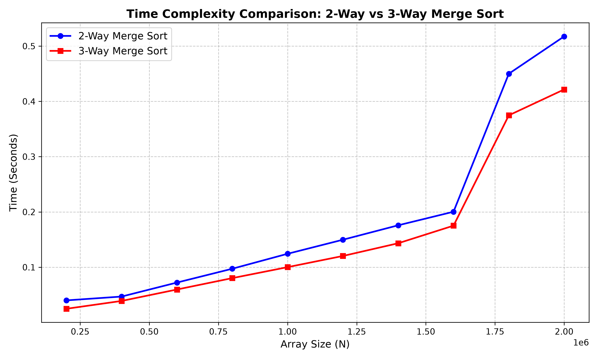

## Merge Sort vs. Modified (3-Way) Merge Sort
This C program helps compare the efficiencies of merge sort and its variant the 3-way merge sort alsgorithm

### How the Code Works
The solution is divided into a C benchmark program and a Python visualization script.

1. **C Program:** 
   - Implements standard `mergeSort2` (divides the array into halves).
   - Implements modified `mergeSort3` (divides the array into thirds and merges using a 3-way subroutine).
   - Generates random arrays of sizes ranging from $N = 200,000$ to $2,000,000$.
   - Times both sorting algorithms using `<time.h>` and exports the raw execution times to `merge_sort_results.csv`.

2. **Python Script:**
   - Uses `pandas` to read the exported `merge_sort_results.csv` data.
   - Uses `matplotlib` to plot Array Size ($N$) vs. Time (Seconds).
   - Generates and saves the final comparative line graph.

### Maths behind this (Time Complexity Analysis)
Both algorithms belong to the $O(N \log N)$ time complexity class, but their exact bounds and recursion depths differ.

**1. Standard 2-Way Merge Sort:**
- Recurrence relation: $T(N) = 2T(N/2) + O(N)$
- Recursion tree depth: $\log_2 N$.
- Merge step comparisons: $ pprox N$ per level.
- Worst-case time complexity: **$O(N \log_2 N)$**.

**2. Modified 3-Way Merge Sort:**
- Recurrence relation: $T(N) = 3T(N/3) + O(N)$
- Recursion tree depth: $\log_3 N$ (which is shallower than $\log_2 N$).
- Merge step comparisons: Merging 3 arrays requires finding the minimum among 3 elements, taking roughly 2 comparisons per placed element. This yields $ pprox 2N$ comparisons per level.
- Worst-case time complexity: **$O(N \log_3 N)$**.

**Theoretical vs. Practical Comparison**
By changing the logarithmic base:
    $$2N \log_3 N = 2N \cdot \frac{\log_2 N}{\log_2 3} \approx 1.26 N \log_2 N$$
Theoretically, 3-way merge sort performs roughly 26% more comparisons than 2-way merge sort.

### Why the Graph Looks the Way It Does
Both curves display the classic $O(N \log N)$ order of growth, appearing mostly linear but curving slightly upwards as $N$ gets very large.

Interestingly, the **3-Way Merge Sort (Red Line)** graph sits below the **2-Way Merge Sort (Blue Line)**, meaning the 3-way approach executed *faster*. Despite requiring more theoretical comparisons, it outperforms the 2-way sort in practice due to:
1. **Fewer Function Calls:** The recursion depth is $\log_3 N$ instead of $\log_2 N$. This heavily reduces the overhead of function call stacks and context switching in C.
2. **Memory Allocation Overheads:** The 3-way merge implementation might be handling internal pointer math or memory blocks more efficiently per step, offsetting the extra comparison costs.


### Plot


### Observations
- **Scaling:** At lower bounds (e.g., $N=200,000$), the difference is marginal. As $N$ approaches $2,000,000$, the performance gap steadily widens.
- **Order of Growth:** The experiment successfully validates that both algorithms scale at $O(N \log N)$. 
- **Theory vs. Practice:** As observed, constant factors hidden in Big-O notation (like recursion depth overhead) can heavily influence real-world performance, making the theoretically "slower" algorithm run faster.

#### How to Run

You can compile the C benchmark, run the execution, and generate the comparative plot with a single command:

```bash
gcc q2.c && ./a.out && python plot.py
```