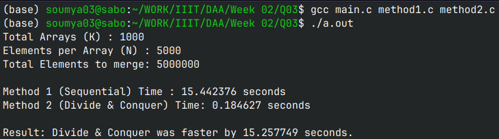

## K-Sorted Arrays Merge Performance Analysis

This C program implements and analyzes two different approaches for merging `K` sorted arrays, each of size `N`. It measures the execution time of each method to demonstrate the efficiency of algorithmic optimization.

### How the Code Works

The program consists of a data generator, a shared merge utility, and two distinct merging algorithms:

1.  **Data Generation**: The `generate_k_sorted_arrays` function initializes `K` arrays, each with `N` elements. It populates them with random integers, ensuring each array remains sequentially sorted in ascending order by adding a random increment to the previous element.
2.  **Shared Merge Utility**: A standard two-pointer `merge` function is used to combine two sorted arrays into a single sorted array.
3.  **Method 1: Sequential Merging**: This approach iterates through the `K` arrays one by one. It starts by taking the first array and sequentially merges it with the next array in the list, continuously accumulating the result into a growing temporary array.
4.  **Method 2: Divide & Conquer**: This recursive approach splits the list of `K` arrays into two halves until a single array is reached. As the recursion unwinds, it merges the arrays pairwise (left half and right half) to build back up to a single sorted array.
5.  **Performance Analysis**: The `analyze_time` function uses the standard C library to benchmark both methods on the exact same dataset, outputting the CPU time taken (in seconds) and explicitly printing which method was faster and by how much.

### Maths Behind This (Complexity Analysis)

The performance difference between the two methods comes down to their mathematical time complexity. Let `K` be the number of arrays and `N` be the number of elements in each array.

#### Method 1: Sequential Merging
*   **Step 1**: Merge arrays of size $N$ and $N 
ightarrow 2N$ operations.
*   **Step 2**: Merge arrays of size $2N$ and $N 
ightarrow 3N$ operations.
*   **Step i**: Merge arrays of size $i \cdot N$ and $N 
ightarrow (i+1)N$ operations.
*   **Total Time**: The total number of operations is approximately $N \sum_{i=1}^{K-1} (i+1) = N \left( \frac{K(K+1)}{2} - 1 \right)$.
*   **Time Complexity**: $\mathcal{O}(N \cdot K^2)$
*   **Space Complexity**: $\mathcal{O}(N \cdot K)$ to store the final combined array (though intermediate array creations peak at $(K-1)N + N$).

#### Method 2: Divide and Conquer
*   **Tree Structure**: The recursive splitting forms a binary recursion tree of height $\log_2(K)$.
*   **Level Cost**: At each level of the recursion tree, we are merging a total of $N \cdot K$ elements across all pair nodes.
*   **Total Time**: Since there are $\log_2(K)$ levels and each level requires $\mathcal{O}(N \cdot K)$ operations.
*   **Time Complexity**: $\mathcal{O}(N \cdot K \log K)$
*   **Space Complexity**: $\mathcal{O}(N \cdot K \log K)$ total dynamically allocated memory across the stack limits, but practically bounded to $\mathcal{O}(N \cdot K)$ peak memory footprint as intermediate arrays are freed during unwinding.

### Execution Results & Analysis:

* **Results AnalysisProblem Constraints:** $K = 1000$ arrays and $N = 5000$ elements per array ($5,000,000$ total elements).
* **Sequential Performance:** In Method 1, every step forces the algorithm to re-scan an ever-growing combined array, scaling quadractically with respect to $K$.
* **Divide & Conquer Performance:** In Method 2, pairwise merges keep sub-array sizes balanced at every level, cutting total comparison operations down to logarithmic growth relative to $K$.

### Observations

1.  **Workload Imbalance in Sequential Merge:** Method 1 becomes increasingly inefficient as $K$ grows because the target merged array continuously expands, forcing repeated traversal of already-sorted elements.

2.  **Balanced Sub-problems:** Method 2 maintains sub-arrays of nearly identical sizes at each recursive level, maximizing efficiency and eliminating redundant traversals.

3.  **Practical Scaling:** For large input parameters (e.g., $K = 1000$, $N = 5000$), the difference between $\mathcal{O}(N \cdot K^2)$ and $\mathcal{O}(N \cdot K \log K)$ translates to a dramatic, multi-fold speedup in real execution time.

#### How to Run

1. **Compile the source files using `gcc`:**
```bash
    gcc main.c method1.c method2.c
```

2. **Execute the output binary based on your Operating System:**

Linux / macOS:
```Bash
    ./a.out
```
Windows (CMD / PowerShell):
```DOS
    .\a.exe
```