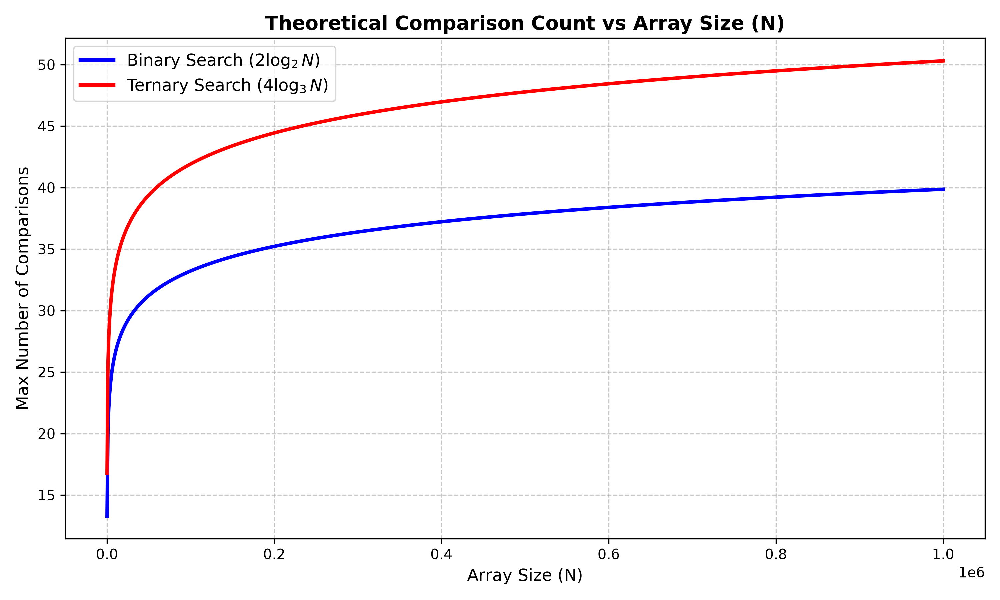

## Binary vs Ternary Search Analysis

### How the Code Works
The project is split into two main components:
1. **C Implementation**: A C program implements iterative versions of both Binary Search and Ternary Search. It tests these algorithms across varying array sizes from 10,000 up to 5,000,000. To simulate the worst-case scenario, the search target is set to an element strictly outside the array's bounds (`target = n + 1`). The program counts the number of comparisons made by each algorithm and exports this data to a `search_comps.csv` file.
2. **Python Visualization**: A Python script uses `numpy` and `matplotlib` to plot a smooth, continuous curve representing the theoretical maximum number of comparisons for both algorithms over an array size `N` ranging up to 1,000,000.

### Maths Behind This
The number of key comparisons can be mathematically modeled using recurrence relations based on how each algorithm divides the search space:

* **Binary Search:** In each step, the algorithm divides the array into 2 halves. In the worst case, it makes up to 2 comparisons per step (one to check for equality at the midpoint, and one to determine whether to go left or right).
  * **Recurrence Relation:** $T(N) = T(N/2) + 2$
  * **Derivation:** By expanding the recurrence relation, we get $T(N) = 2 + 2 + \dots + 2$ for exactly $\log_2 N$ steps. Thus, the theoretical maximum number of comparisons is $2 \log_2 N$.
* **Ternary Search:** In each step, the algorithm divides the array into 3 parts using two midpoints. In the worst case, it makes up to 4 comparisons per step (two to check for equality at both midpoints, and up to two more to determine which of the three segments to explore).
  * **Recurrence Relation:** $T(N) = T(N/3) + 4$
  * **Derivation:** By expanding the recurrence relation, we get $T(N) = 4 + 4 + \dots + 4$ for exactly $\log_3 N$ steps. Thus, the theoretical maximum number of comparisons is $4 \log_3 N$.

#### Comparison Factor
To find out how much more time (in terms of comparisons) ternary search takes compared to binary search, we evaluate the ratio of their worst-case comparisons:

$$\text{Ratio} = \frac{4 \log_3 N}{2 \log_2 N}$$

Using the change of base formula ($\log_b x = \frac{\ln x}{\ln b}$):

$$\text{Ratio} = \frac{4 \frac{\ln N}{\ln 3}}{2 \frac{\ln N}{\ln 2}} = 2 \frac{\ln 2}{\ln 3}$$

$$\text{Ratio} \approx 2 \times \frac{0.693}{1.098} \approx 1.261$$

This means that in the worst case, **Ternary Search requires approximately 1.26 times more comparisons than Binary Search**.

### Complexity Overview
* **Time Complexity:**
  * Binary Search: $\mathcal{O}(\log_2 N)$
  * Ternary Search: $\mathcal{O}(\log_3 N)$
* **Space Complexity:** $\mathcal{O}(1)$ for both algorithms, as they are implemented iteratively without recursive stack overhead.

### Observation and Output
While Ternary Search reduces the search space faster than Binary Search (since it divides by 3 instead of 2), it requires more key comparisons per iteration. Mathematically, $4 \log_3 N$ is greater than $2 \log_2 N$. 

This mathematical reality is perfectly reflected in the generated plot:



As seen in the plot, the red curve representing Ternary Search ($4 \log_3 N$) sits significantly higher than the blue curve for Binary Search ($2 \log_2 N$). This demonstrates that despite having a smaller number of overall iterations, Ternary Search performs worse in practice due to the overhead of extra comparisons per step.

#### How to Compile and Run

You can compile the C benchmark, run the execution, and generate the comparative plot with a single command:

```bash
gcc q1.c && ./a.out && python plot.py
```