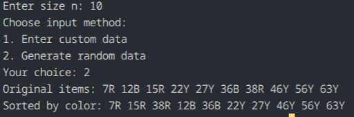

## Question 1: Sort Items by Color

### How the code works
This program accepts a size `n` from the user and then gives the user a choice:
- enter custom data manually, or
- generate random values automatically.

The program stores the numbers in one array and the corresponding colors in another array. It separates the items into three groups:
- Red (`R`)
- Blue (`B`)
- Yellow (`Y`)

Each group is placed into a temporary array, then the grouped values are copied back into the original array in the order `R`, then `B`, then `Y`.

### Logic behind this
The idea is based on grouping by category rather than numerical sorting. We do not compare numbers against each other; instead, the program scans the array once and distributes every element into a bucket according to its color.

If there are `n` items, the work is essentially:
- one pass to classify each item
- one pass to rewrite the items in required order

This is a stable bucket-based arrangement, where each item keeps its relative group ordering as it is copied back.

### Complexity analysis
For `n` elements:
- Classification step: `O(n)`
- Rebuild step: `O(n)`
- Total: `O(n)`
- Extra space: `O(n)` because three temporary arrays are created.

### Observation

