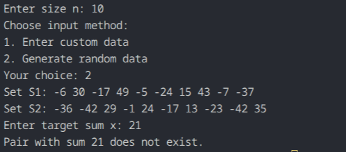

## Question 2: Pair with Given Sum

### How the code works
The program asks for:
- size `n`
- whether to use custom input or random values
- target sum `x`

It creates two arrays `S1` and `S2`, sorts both using standard Quicksort (`qsort`), and checks whether there exists a pair such that:

`S1[i] + S2[j] == x`

The algorithm moves two pointers:
- `i` starts from the beginning of `S1` (index `0`)
- `j` starts from the end of `S2` (index `n - 1`)

If the sum `S1[i] + S2[j]` is smaller than `x`, it increases `i`; if the sum is larger than `x`, it decreases `j`. If `sum == x`, a pair exists.

### Maths or logic behind this
This is a two-pointer strategy that works after both arrays are sorted in non-decreasing order.

When arrays are sorted:
- `S1[i]` increases as `i` moves right.
- `S2[j]` decreases as `j` moves left.

By starting `i` at the minimum of `S1` and `j` at the maximum of `S2`, any comparison tells us deterministically which pointer to move, pruning the search space down to `O(n)` steps.

### Complexity analysis
For `n` elements:
- Sorting `S1` and `S2`: `O(n log n)` using `qsort`
- Two-pointer scan: `O(n)`
- Total time complexity: `O(n log n)`
- Extra space: `O(1)` auxiliary space (excluding the allocated input arrays)

### Observation

