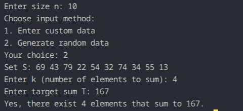

## Question 3: K-Sum Problem

### How the code works
The program asks for:
- size `n`
- input type (custom or random)
- number of elements `k` to choose
- target sum `T`

It sorts the array `S` using Quicksort (`qsort`) and recursively determines whether there exist `k` distinct elements in `S` whose sum equals `T`.

The recursive solver (`checkKSum`) uses optimized base cases:
- **`k = 1`**: Uses Binary Search in `O(log n)` time.
- **`k = 2`**: Uses the Two-Pointer technique in `O(n)` time.
- **`k > 2`**: Iteratively picks an element `S[i]` and recursively reduces the problem to finding `(k - 1)` elements that sum to `T - S[i]`.

### Maths or logic behind this
Sorting the array upfront allows optimized search strategies:
1. For `1`-sum, the target can be located via binary search on the sorted elements.
2. For `2`-sum, two pointers placed at opposite ends scan inwards in linear time.
3. For higher values of `k`, picking elements sequentially reduces the problem to `(k - 1)`-sum while avoiding duplicate search paths.

### Complexity analysis
For `n` elements and target choice `k`:
- Sorting: `O(n log n)` using `qsort`
- Search step:
  - `k = 1`: `O(log n)`
  - `k = 2`: `O(n)`
  - `k >= 3`: `O(n^(k - 1))`
- Total time complexity: **`O(n log n + n^(k - 1))`**
- Extra space: `O(k)` recursion stack space

### Observation
