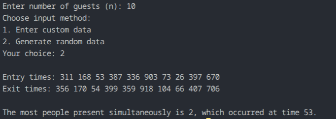

## Question 4: Maximum People Present at a Party

### How the code works
The program asks for:
- size `n`
- custom or random input

For each guest, it takes:
- entry time
- exit time

It sorts the entry times and exit times separately using C's standard `qsort()`, and then scans both arrays with two pointers. It tracks how many people are inside the party at any moment and keeps the maximum value.

### Maths or logic behind this
At any given time, the number of people present equals:

`(people who entered so far) - (people who exited so far)`

If we sort entry times and exit times, we can compare them as time advances. Every time an entry happens before an exit, the count increases; otherwise, it decreases.

The maximum count seen during this process is the answer.

### Complexity analysis
For `n` guests:
- sorting entries: `O(n log n)`
- sorting exits: `O(n log n)`
- scan: `O(n)`
- Total: `O(n log n)`
- Extra space: `O(n)` for copied arrays

### Observation
