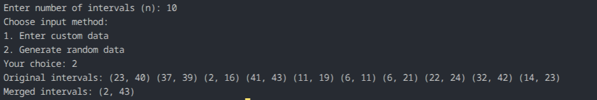

## Question 5: Merge Overlapping Intervals

### How the code works
The program asks the user for:
- size `n`
- custom or random input

Each interval is stored as a pair `(start, end)`. The program sorts the intervals by start time using `qsort()`, then merges any overlapping intervals.

If the next interval starts before or at the current merged interval end, it is merged; otherwise, a new interval is started.

### Maths or logic behind this
Two intervals overlap if:

`next.start <= current.end`

If this condition is true, the merged interval must span from the earlier start to the larger of the two ends.

This logic works because after sorting by start time, overlapping intervals appear next to each other, and the global answer can be built in a single pass.

### Complexity analysis
For `n` intervals:
- sorting: `O(n log n)` using `qsort()`
- merge pass: `O(n)`
- Total: `O(n log n)`
- Extra space: `O(n)` for the result array and copied data

### Observation
