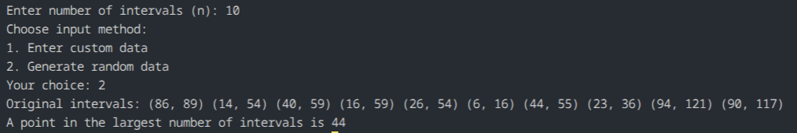

## Question 6: Point in Maximum Number of Intervals

### How the code works
The program asks for:
- size `n`
- custom or random interval data

It stores each interval as `(start, end)`. Then it separates all start points and end points into two arrays, sorts both using `qsort()`, and scans with two pointers to find the point where the maximum number of intervals overlap.

### Maths or logic behind this
For every point `p`, the number of intervals covering it is:

`count of intervals with start <= p` minus `count of intervals with end < p`

By sorting start points and end points, the algorithm can sweep through points in order and maintain the current overlap count. Whenever the current count is greater than the best value seen so far, it updates the answer.

### Complexity analysis
For `n` intervals:
- sorting starts: `O(n log n)`
- sorting ends: `O(n log n)`
- sweep: `O(n)`
- Total: `O(n log n)`
- Extra space: `O(n)` for start and end arrays

### Observation
