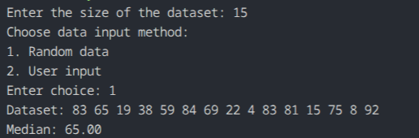

# Q01 - Median Without Sorting

## Question Title

Find the median of a list of `N` numbers without sorting the list.

## How the Code Works

The program first asks for the dataset size and the input mode. It then fills the array either with random values or values entered by the user. To find the median without sorting the whole array, it uses Quickselect. For odd-sized datasets, it finds the middle element directly. For even-sized datasets, it finds the two middle elements separately and averages them.

## Maths / Logic Behind This

The median is the middle value of an ordered list. Instead of ordering the entire list, Quickselect repeatedly partitions the array around a pivot until the required index is found. This preserves the correct middle position without performing a full sort.

For even `N`, the median is:

$$
\text{median} = \frac{a_{(N/2)-1} + a_{N/2}}{2}
$$

## Complexity Analysis

- Average time complexity: `O(N)`
- Worst-case time complexity: `O(N^2)`
- Extra space complexity: `O(N)` because the array is copied for safe selection

## Output

