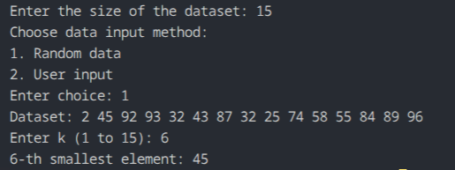

# Q02 - K-th Smallest Element Without Sorting

## Question Title

Find the `k`-th smallest element in a given list of `N` numbers without sorting the list.

## How the Code Works

The program accepts the dataset size, then asks whether to fill the array with random values or user-entered values. After that, it asks for `k`. The answer is found with Quickselect, which partitions the array until the element at index `k - 1` is placed in its correct position.

## Maths / Logic Behind This

If the array were sorted, the `k`-th smallest element would be at position `k - 1` using zero-based indexing. Quickselect finds that position directly by comparing each partition with the target index, so a full sort is unnecessary.

## Complexity Analysis

- Average time complexity: `O(N)`
- Worst-case time complexity: `O(N^2)`
- Extra space complexity: `O(N)` because a copy of the data is used

## Output

