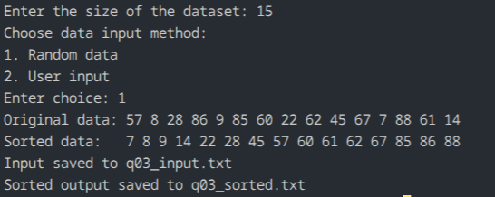

# Q03 - Quick Sort with screen output and file storage

## Question Title

Implement Quick Sort of `N` random or user-entered elements, store the input and output in files, and also display both on the terminal.

## How the Code Works

The program asks for the dataset size and the input method. It then fills the array with either random values or values entered by the user. The original array is saved in `q03_input.txt`, printed on the screen, and then sorted using Quick Sort. The sorted array is also printed to the terminal and saved in `q03_sorted.txt`.

## Maths / Logic Behind This

Quick Sort follows a divide-and-conquer strategy. A pivot splits the array into values less than or equal to the pivot and values greater than the pivot. The same process is applied recursively to the two subarrays until the full list is sorted.

## Complexity Analysis

- Average time complexity: `O(N log N)`
- Worst-case time complexity: `O(N^2)`
- Extra space complexity: `O(log N)` on average because of recursion

## Output

The program displays the original and sorted arrays in the terminal and stores them in `q03_input.txt` and `q03_sorted.txt` respectively.

