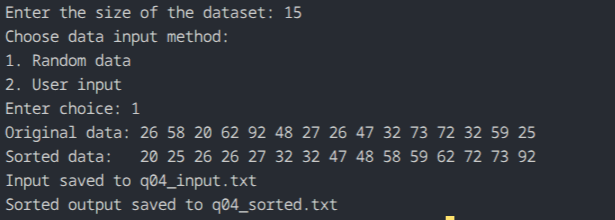

# Q04 - Heap Sort with screen output and file storage

## Question Title

Implement Heap Sort of `N` random or user-entered elements, store the input and output in files, and also display both on the terminal.

## How the Code Works

The program asks for the dataset size and input mode. It fills the array with either random values or values entered by the user. The original data is saved in `q04_input.txt`, printed on the terminal, and then sorted using Heap Sort. The sorted result is also printed and stored in `q04_sorted.txt`.

## Maths / Logic Behind This

Heap Sort first converts the array into a max heap. In a max heap, the largest value is at the root. The algorithm then swaps the root with the last element, shrinks the heap, and restores the heap property. Repeating this places the elements in ascending order.

## Complexity Analysis

- Time complexity: `O(N log N)` in best, average, and worst cases
- Extra space complexity: `O(1)`

## Output

The program shows the original and sorted arrays in the terminal and stores them in `q04_input.txt` and `q04_sorted.txt` respectively.

